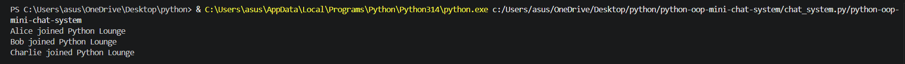
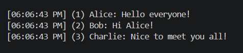
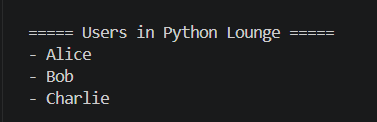

# Python OOP Mini Chat System

A console-based chat application built using Python and Object-Oriented Programming.

## Features
- Join and leave chat rooms
- Send messages
- Timestamps
- View users
- View chat history

# Python OOP Mini Chat System

A console-based chat application built using Python and Object-Oriented Programming.

## Features

- Join and leave chat rooms
- Send messages
- Timestamps
- View users
- View chat history

## Screenshots

### Chat Messages


### Users


### Chat History


## How to Run

```bash
python chat_system.py
```

## OOP Concepts Used

- Classes and Objects
- Constructors (`__init__`)
- Encapsulation
- Class Variables
- Object Interaction
- Special Method (`__str__`)